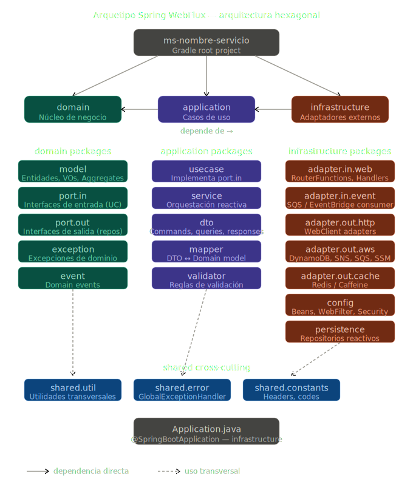

# Java Spring WebFlux Hexagonal Architecture Archetype

> Arquetipo Spring WebFlux — Arquitectura Hexagonal de Puertos y Adaptadores  
> Java 17/21 · Spring Boot 3.x · Project Reactor · Gradle 8 · AWS SDK v2

---

## Tabla de contenidos

1. [Visión general](#1-visión-general)
2. [Principios de diseño](#2-principios-de-diseño)
3. [Estructura de módulos](#3-estructura-de-módulos)
4. [Detalle de cada módulo](#4-detalle-de-cada-módulo)
    - 4.1 [domain](#41-domain)
    - 4.2 [application](#42-application)
    - 4.3 [infrastructure](#43-infrastructure)
5. [Regla de dependencias](#5-regla-de-dependencias)
6. [Stack tecnológico](#6-stack-tecnológico)
7. [Configuración del entorno](#7-configuración-del-entorno)
8. [Variables de entorno y parámetros AWS](#8-variables-de-entorno-y-parámetros-aws)
9. [Ejecución local con LocalStack](#9-ejecución-local-con-localstack)
10. [API Reference](#10-api-reference)
11. [Programación reactiva — guía rápida](#11-programación-reactiva--guía-rápida)
12. [Resiliencia y circuit breaker](#12-resiliencia-y-circuit-breaker)
13. [Manejo de errores](#13-manejo-de-errores)
14. [Testing](#14-testing)
15. [Convenciones de código](#15-convenciones-de-código)
16. [Pipeline CI/CD](#16-pipeline-cicd)
17. [Decisiones de arquitectura (ADR)](#17-decisiones-de-arquitectura-adr)
18. [Preguntas frecuentes](#18-preguntas-frecuentes)

---

## 1. Visión general

Este repositorio es el **arquetipo base** para cualquier microservicio backend del ecosistema Enterprise. Implementa la arquitectura **Hexagonal (Ports & Adapters)** sobre **Spring WebFlux** con programación completamente reactiva y no bloqueante.

El objetivo principal es que el **núcleo de negocio (domain) sea independiente de cualquier framework, base de datos o proveedor cloud**. Spring, AWS SDK, WebClient y DynamoDB son detalles de infraestructura que pueden sustituirse sin tocar una sola línea de lógica de negocio.

```
Entrada (HTTP / SQS / EventBridge)
                    │
                    ▼
              [ Adapter IN ]  ──►  [ Application / Use Case ]  ──►  [ Adapter OUT ]
                                           │                      (HTTP, DynamoDB, SNS…)
                                           ▼
                                      [ Domain ]
                                 (modelo puro — sin Spring)
```

---

## 2. Principios de diseño



### SOLID aplicado por capa

| Principio                       | Cómo se aplica en este arquetipo                                                                                                                                                                  |
|---------------------------------|---------------------------------------------------------------------------------------------------------------------------------------------------------------------------------------------------|
| **SRP** — Single Responsibility | `CustomerRouter` solo define rutas. `CustomerHandler` solo transforma request/response. `CustomerOrchestrationService` solo orquesta casos de uso. Un cambio de framework HTTP no toca la lógica. |
| **OCP** — Open/Closed           | Los casos de uso se extienden implementando nuevos `port.in`. Nunca se modifica el código existente para agregar comportamiento.                                                                  |
| **LSP** — Liskov Substitution   | Cualquier implementación de `CustomerRepositoryPort` (DynamoDB, Redis, in-memory para tests) debe ser intercambiable sin romper el contrato.                                                      |
| **ISP** — Interface Segregation | Los puertos están granularizados: `GetCustomerUseCase`, `UpdateCustomerUseCase`, `DeleteCustomerUseCase` son interfaces separadas. Ningún handler depende de métodos que no usa.                  |
| **DIP** — Dependency Inversion  | Los casos de uso dependen de `CustomerRepositoryPort` (abstracción), nunca de `DynamoDbCustomerAdapter` (detalle). Spring inyecta la implementación en tiempo de arranque.                        |

### Clean Code

- Nombres que expresan intención: `findActiveCustomerById`, no `getData`.
- Métodos de máximo 20 líneas. Si crece, extraer a método privado con nombre descriptivo.
- Sin comentarios que expliquen *qué* hace el código — el código se explica solo. Comentarios solo para *por qué* (decisiones de negocio no obvias).
- Cero lógica en constructores.
- Inmutabilidad por defecto: `final` en campos, Value Objects inmutables.

---

## 3. Estructura de módulos

```
ms-nombre-servicio/
├── build.gradle                  ← dependencias compartidas (BOM, plugins)
├── settings.gradle               ← include 'domain', 'application', 'infrastructure'
├── gradle.properties
│
├── domain/
│   └── src/main/java/com/raulbolivarnavas/ms/domain/
│       ├── model/
│       │   ├── Customer.java              ← Aggregate root
│       │   ├── CustomerId.java            ← Value Object
│       │   └── CustomerStatus.java        ← Enum de dominio
│       ├── port/
│       │   ├── in/
│       │   │   ├── GetCustomerUseCase.java        ← interface (ISP)
│       │   │   └── UpdateCustomerUseCase.java
│       │   └── out/
│       │       ├── CustomerRepositoryPort.java    ← interface (DIP)
│       │       └── CustomerEventPublisherPort.java
│       ├── exception/
│       │   ├── CustomerNotFoundException.java
│       │   └── CustomerDomainException.java
│       └── event/
│           └── CustomerUpdatedEvent.java
│
├── application/
│   └── src/main/java/com/raulbolivarnavas/ms/application/
│       ├── usecase/
│       │   ├── GetCustomerUseCaseImpl.java    ← implements port.in
│       │   └── UpdateCustomerUseCaseImpl.java
│       ├── service/
│       │   └── CustomerOrchestrationService.java
│       ├── dto/
│       │   ├── command/
│       │   │   └── UpdateCustomerCommand.java
│       │   ├── query/
│       │   │   └── GetCustomerQuery.java
│       │   └── response/
│       │       └── CustomerResponse.java
│       ├── mapper/
│       │   └── CustomerMapper.java          ← MapStruct o manual
│       └── validator/
│           └── CustomerValidator.java
│
└── infrastructure/
    └── src/main/java/com/raulbolivarnavas/ms/infrastructure/
        ├── adapter/
        │   ├── in/
        │   │   ├── web/
        │   │   │   ├── CustomerRouter.java        ← RouterFunction (SRP)
        │   │   │   └── CustomerHandler.java       ← ServerRequest → Mono
        │   │   └── event/
        │   │       └── SqsCustomerEventConsumer.java
        │   └── out/
        │       ├── http/
        │       │   ├── ExternalApiAdapter.java    ← implements port.out
        │       │   └── ExternalApiClient.java     ← WebClient wrapper
        │       ├── aws/
        │       │   ├── DynamoDbCustomerAdapter.java
        │       │   ├── SnsEventPublisherAdapter.java
        │       │   └── SsmParameterAdapter.java
        │       └── cache/
        │           └── CaffeineCustomerCacheAdapter.java
        ├── persistence/
        │   ├── entity/
        │   │   └── CustomerEntity.java
        │   └── repository/
        │       └── CustomerReactiveRepository.java
        ├── config/
        │   ├── WebClientConfig.java
        │   ├── AwsConfig.java
        │   ├── ResilienceConfig.java
        │   ├── SecurityConfig.java
        │   └── filter/
        │       ├── HeaderValidationFilter.java    ← @Order(-10)
        │       └── CorrelationIdFilter.java
        ├── shared/
        │   ├── util/
        │   │   └── ReactiveUtils.java
        │   ├── error/
        │   │   └── GlobalExceptionHandler.java    ← @ControllerAdvice
        │   └── constants/
        │       └── HttpHeaders.java
        └── Application.java                       ← @SpringBootApplication
```

El módulo `infrastructure` es el único que conoce Spring Boot. Los módulos `domain` y `application` son JAR puros de Java.

---

## 4. Detalle de cada módulo

### 4.1 `domain`

**Responsabilidad:** Contiene el modelo de negocio, las reglas invariantes y las interfaces (puertos) que definen qué necesita y qué ofrece el dominio. No importa ninguna librería de framework.

```
domain/src/main/java/com/raulbolivarnavas/<servicio>/domain/
│
├── model/
│   ├── Customer.java               # Aggregate root — encapsula invariantes
│   ├── CustomerId.java             # Value Object — inmutable, con validación propia
│   ├── CustomerStatus.java         # Enum de dominio (ACTIVE, INACTIVE, SUSPENDED)
│   └── Money.java                  # VO para montos — nunca float/double
│
├── port/
│   ├── in/                         # Lo que el mundo exterior puede pedirle al dominio
│   │   ├── GetCustomerUseCase.java
│   │   ├── UpdateCustomerUseCase.java
│   │   └── DeleteCustomerUseCase.java
│   └── out/                        # Lo que el dominio necesita del mundo exterior
│       ├── CustomerRepositoryPort.java
│       ├── CustomerCachePort.java
│       └── CustomerEventPublisherPort.java
│
├── exception/
│   ├── CustomerNotFoundException.java    # Excepción semántica de dominio
│   ├── CustomerAlreadyExistsException.java
│   └── CustomerDomainException.java      # Base para todas las de dominio
│
└── event/
    ├── CustomerCreatedEvent.java
    └── CustomerUpdatedEvent.java
```

#### Aggregate Root — ejemplo de invariantes

```java
// domain/model/Customer.java
public final class Customer {

    private final CustomerId id;
    private CustomerStatus status;
    private String fullName;

    private Customer(CustomerId id, String fullName) {
        Objects.requireNonNull(id, "CustomerId must not be null");
        Objects.requireNonNull(fullName, "fullName must not be null");
        if (fullName.isBlank()) throw new CustomerDomainException("fullName must not be blank");
        this.id = id;
        this.fullName = fullName;
        this.status = CustomerStatus.ACTIVE;
    }

    public static Customer create(CustomerId id, String fullName) {
        return new Customer(id, fullName);
    }

    public void suspend() {
        if (this.status == CustomerStatus.INACTIVE) {
            throw new CustomerDomainException("Cannot suspend an inactive customer");
        }
        this.status = CustomerStatus.SUSPENDED;
    }

    // getters — sin setters públicos
}
```

#### Puerto de entrada — ejemplo

```java
// domain/port/in/GetCustomerUseCase.java
public interface GetCustomerUseCase {
    Mono<Customer> findById(CustomerId id);
    Flux<Customer> findAllActive();
}
```

> **Nota:** Los puertos de entrada pueden retornar tipos reactivos (`Mono`/`Flux`) o tipos del dominio puro según la preferencia del equipo. Este arquetipo usa reactor en los puertos para mantener la cadena reactiva end-to-end.

#### Puerto de salida — ejemplo

```java
// domain/port/out/CustomerRepositoryPort.java
public interface CustomerRepositoryPort {
    Mono<Customer> findById(CustomerId id);
    Mono<Customer> save(Customer customer);
    Mono<Void> deleteById(CustomerId id);
}
```

---

### 4.2 `application`

**Responsabilidad:** Orquesta los casos de uso. Implementa los puertos de entrada usando los puertos de salida. Contiene DTOs de transferencia y mappers. No contiene lógica de negocio — eso vive en `domain`.

```
application/src/main/java/com/raulbolivarnavas/<servicio>/application/
│
├── usecase/
│   ├── GetCustomerUseCaseImpl.java         # implements GetCustomerUseCase
│   └── UpdateCustomerUseCaseImpl.java      # implements UpdateCustomerUseCase
│
├── service/
│   └── CustomerOrchestrationService.java   # orquesta múltiples use cases
│
├── dto/
│   ├── command/
│   │   ├── CreateCustomerCommand.java      # inmutable — record Java
│   │   └── UpdateCustomerCommand.java
│   ├── query/
│   │   └── GetCustomerQuery.java
│   └── response/
│       └── CustomerResponse.java           # lo que se devuelve al adaptador de entrada
│
├── mapper/
│   └── CustomerMapper.java                 # DTO ↔ Domain model
│
└── validator/
    └── CustomerCommandValidator.java       # validaciones de aplicación (no de dominio)
```

#### Use Case — ejemplo de implementación

```java
// application/usecase/GetCustomerUseCaseImpl.java
@Component
@RequiredArgsConstructor
public class GetCustomerUseCaseImpl implements GetCustomerUseCase {

    private final CustomerRepositoryPort repository;   // puerto de salida (DIP)
    private final CustomerCachePort cache;
    private final CustomerMapper mapper;

    @Override
    public Mono<Customer> findById(CustomerId id) {
        return cache.get(id)
            .switchIfEmpty(
                repository.findById(id)
                    .doOnNext(customer -> cache.put(id, customer).subscribe())
                    .switchIfEmpty(Mono.error(new CustomerNotFoundException(id)))
            );
    }
}
```

#### Command — record inmutable

```java
// application/dto/command/CreateCustomerCommand.java
public record CreateCustomerCommand(
    @NotBlank String fullName,
    @NotBlank String documentNumber,
    @NotNull DocumentType documentType
) {}
```

---

### 4.3 `infrastructure`

**Responsabilidad:** Implementa los puertos de salida, expone los puertos de entrada (HTTP, eventos), configura el contexto de Spring y gestiona todos los detalles técnicos (AWS, WebClient, Resilience4j, filtros).

```
infrastructure/src/main/java/com/raulbolivarnavas/<servicio>/infrastructure/
│
├── adapter/
│   ├── in/
│   │   ├── web/
│   │   │   ├── CustomerRouter.java            # RouterFunction — sin anotaciones @Controller
│   │   │   └── CustomerHandler.java           # ServerRequest → Mono<ServerResponse>
│   │   └── event/
│   │       ├── SqsCustomerEventConsumer.java  # listener reactivo SQS
│   │       └── EventBridgeConsumer.java
│   │
│   └── out/
│       ├── http/
│       │   ├── ExternalApiAdapter.java        # implements port.out — usa WebClient
│       │   └── ExternalApiWebClient.java      # configuración y llamadas HTTP
│       ├── aws/
│       │   ├── DynamoDbCustomerAdapter.java   # implements CustomerRepositoryPort
│       │   ├── SnsEventPublisherAdapter.java  # implements CustomerEventPublisherPort
│       │   ├── SsmParameterAdapter.java
│       │   └── SecretsManagerAdapter.java
│       └── cache/
│           ├── CaffeineCustomerCacheAdapter.java  # implements CustomerCachePort
│           └── RedisCustomerCacheAdapter.java
│
├── persistence/
│   ├── entity/
│   │   └── CustomerDynamoEntity.java          # anotaciones DynamoDB — solo infra
│   └── repository/
│       └── DynamoDbCustomerRepository.java    # operaciones CRUD reactivas
│
├── config/
│   ├── WebClientConfig.java
│   ├── AwsConfig.java                         # beans por cuenta: StaticCredentialsProvider
│   ├── ResilienceConfig.java                  # circuit breakers desde SSM
│   ├── CacheConfig.java
│   └── filter/
│       ├── HeaderValidationFilter.java        # @Order(-10): Application-Id, Source-Bank
│       └── CorrelationIdFilter.java
│
├── shared/
│   ├── util/
│   │   ├── ReactiveUtils.java
│   │   └── JsonUtils.java
│   ├── error/
│   │   ├── GlobalExceptionHandler.java        # @ControllerAdvice reactivo
│   │   └── ErrorResponse.java                 # estructura estándar de error
│   └── constants/
│       ├── HttpHeaders.java
│       └── ErrorCodes.java
│
└── Application.java
```

#### Router — functional endpoints (sin @Controller)

```java
// infrastructure/adapter/in/web/CustomerRouter.java
@Configuration
public class CustomerRouter {

    @Bean
    public RouterFunction<ServerResponse> customerRoutes(CustomerHandler handler) {
        return RouterFunctions.route()
            .GET("/api/v1/customers/{id}", handler::getById)
            .POST("/api/v1/customers", handler::create)
            .PUT("/api/v1/customers/{id}", handler::update)
            .DELETE("/api/v1/customers/{id}", handler::delete)
            .build();
    }
}
```

#### Handler — sin lógica de negocio

```java
// infrastructure/adapter/in/web/CustomerHandler.java
@Component
@RequiredArgsConstructor
public class CustomerHandler {

    private final GetCustomerUseCase getCustomerUseCase;
    private final CustomerMapper mapper;

    public Mono<ServerResponse> getById(ServerRequest request) {
        CustomerId id = CustomerId.of(request.pathVariable("id"));
        return getCustomerUseCase.findById(id)
            .map(mapper::toResponse)
            .flatMap(response -> ServerResponse.ok()
                .contentType(MediaType.APPLICATION_JSON)
                .bodyValue(response))
            .onErrorResume(CustomerNotFoundException.class, ex ->
                ServerResponse.notFound().build());
    }
}
```

#### Adaptador de salida — DynamoDB

```java
// infrastructure/adapter/out/aws/DynamoDbCustomerAdapter.java
@Component
@RequiredArgsConstructor
public class DynamoDbCustomerAdapter implements CustomerRepositoryPort {

    private final DynamoDbAsyncClient dynamoClient;
    private final CustomerDynamoMapper mapper;

    @Override
    public Mono<Customer> findById(CustomerId id) {
        GetItemRequest request = GetItemRequest.builder()
            .tableName("customers")
            .key(Map.of("pk", AttributeValue.fromS(id.value())))
            .build();

        return Mono.fromFuture(() -> dynamoClient.getItem(request))
            .filter(response -> response.hasItem())
            .map(response -> mapper.toDomain(response.item()))
            .switchIfEmpty(Mono.empty());
    }
}
```

---

## 5. Regla de dependencias

```
[ infrastructure ]  →  [ application ]  →  [ domain ]
```

- `domain` no importa nada externo. Sin Spring. Sin AWS. Sin Reactor (opcional).
- `application` importa solo `domain`. Puede usar Reactor. Sin Spring annotations (excepto `@Component`).
- `infrastructure` importa `application` y `domain`. Aquí vive todo lo de Spring, AWS, WebClient.

**Regla de oro:** Si en `domain` aparece un `import org.springframework.*`, es un error de arquitectura.

Para verificar en Gradle:

```groovy
// domain/build.gradle
dependencies {
    // SIN spring-boot-starter, SIN aws-sdk
    implementation 'io.projectreactor:reactor-core'   // opcional
}

// application/build.gradle
dependencies {
    implementation project(':domain')
    implementation 'io.projectreactor:reactor-core'
    compileOnly 'org.springframework:spring-context'  // solo @Component
}

// infrastructure/build.gradle
dependencies {
    implementation project(':application')
    implementation project(':domain')
    implementation 'org.springframework.boot:spring-boot-starter-webflux'
    implementation 'software.amazon.awssdk:dynamodb'
    // ... resto de AWS, Resilience4j, etc.
}
```

---

## 6. Stack tecnológico

| Categoría            | Librería                    | Versión |
|----------------------|-----------------------------|---------|
| Runtime              | Java                        | 17+ LTS |
| Framework            | Spring Boot                 | 3.5.x   |
| HTTP reactivo        | Spring WebFlux + Netty      | 6.x     |
| Reactor              | Project Reactor             | 3.6.x   |
| Build                | Gradle                      | 8.x     |
| AWS SDK              | AWS SDK for Java v2         | 2.25.x  |
| Resiliencia          | Resilience4j                | 2.x     |
| Cache L1             | Caffeine                    | 3.x     |
| Cache L2             | Spring Data Redis Reactive  | 3.x     |
| Mappers              | MapStruct                   | 1.5.x   |
| Validación           | Jakarta Validation          | 3.x     |
| Logging              | Logback + SLF4J             | —       |
| Tests unitarios      | JUnit 5 + Mockito           | —       |
| Tests reactivos      | reactor-test (StepVerifier) | —       |
| Tests de integración | Testcontainers              | 1.19.x  |
| Mocks HTTP           | WireMock                    | 3.x     |
| LocalStack           | localstack/localstack       | 3.x     |

---

## 7. Configuración del entorno

### Requisitos

- Java 17+ (`java -version`)
- Docker Desktop (para LocalStack y Testcontainers)
- AWS CLI v2 (opcional, para inspección manual)
- Gradle 8+ (o usar el wrapper incluido `./gradlew`)

### Clonar y compilar

```bash
git clone https://github.com/raulbolivarnavas/<nombre-repo>.git
cd <nombre-repo>

# Compilar todos los módulos
./gradlew clean build

# Solo compilar sin tests
./gradlew clean assemble

# Verificar dependencias entre módulos
./gradlew dependencies
```

### Ejecutar localmente

```bash
# Con LocalStack activo (ver sección 9)
./gradlew :infrastructure:bootRun \
  --args='--spring.profiles.active=local'
```

### Perfiles de Spring disponibles

| Perfil  | Uso                               |
|---------|-----------------------------------|
| `local` | LocalStack, logs verbose, sin TLS |
| `dev`   | AWS dev account, logs debug       |
| `qa`    | AWS qa account, logs info         |
| `prod`  | AWS prod account, logs warn       |

---

## 8. Variables de entorno y parámetros AWS

### Variables de entorno requeridas

```bash
# Identidad de la aplicación
APP_NAME=ms-nombre-servicio
APP_VERSION=1.0.0

# AWS — por cuenta (multi-account pattern)
AWS_REGION=us-east-1
AWS_ACCESS_KEY_ID=<key>
AWS_SECRET_ACCESS_KEY=<secret>

# Para cuenta secundaria (si aplica)
AWS_SECONDARY_ACCESS_KEY_ID=<key>
AWS_SECONDARY_SECRET_ACCESS_KEY=<secret>

# LocalStack (solo perfil local)
AWS_ENDPOINT_OVERRIDE=http://localhost:4566
```

### Parámetros desde SSM Parameter Store

```
/raulbolivarnavas/<servicio>/config/database-url
/raulbolivarnavas/<servicio>/config/resilience/circuit-breaker/failure-rate-threshold
/raulbolivarnavas/<servicio>/config/resilience/circuit-breaker/wait-duration-seconds
/raulbolivarnavas/<servicio>/config/cache/ttl-seconds
```

### Secretos desde Secrets Manager

```
/raulbolivarnavas/<servicio>/secrets/external-api-key
/raulbolivarnavas/<servicio>/secrets/db-password
```

### Caché de configuración

Los parámetros de SSM y Secrets Manager se cachean por **12 horas** con refresh en background usando `Flux.interval`. Este TTL es intencional — no hay hot-reload. Un reinicio del pod fuerza la recarga inmediata.

```yaml
# application-local.yml
aws:
  ssm:
    cache-ttl-hours: 12
  secrets:
    cache-ttl-hours: 12
  endpoint-override: http://localhost:4566
```

---

## 9. Ejecución local con LocalStack

### `docker-compose.yml`

```yaml
version: '3.8'
services:
  localstack:
    image: localstack/localstack:3
    ports:
      - "4566:4566"
    environment:
      - SERVICES=dynamodb,sqs,sns,ssm,secretsmanager,lambda,events
      - DEFAULT_REGION=us-east-1
      - AWS_DEFAULT_REGION=us-east-1
    volumes:
      - ./localstack/init:/etc/localstack/init/ready.d
      - /var/run/docker.sock:/var/run/docker.sock
```

### Scripts de inicialización

```bash
# localstack/init/01-create-tables.sh
awslocal dynamodb create-table \
  --table-name customers \
  --attribute-definitions AttributeName=pk,AttributeType=S \
  --key-schema AttributeName=pk,KeyType=HASH \
  --billing-mode PAY_PER_REQUEST \
  --region us-east-1

# localstack/init/02-create-queues.sh
awslocal sqs create-queue --queue-name customer-events-queue

# localstack/init/03-seed-params.sh
awslocal ssm put-parameter \
  --name "/raulbolivarnavas/ms-nombre-servicio/config/cache/ttl-seconds" \
  --value "3600" \
  --type String
```

### Iniciar el entorno completo

```bash
# Levantar LocalStack
docker-compose up -d localstack

# Esperar a que inicialice (verificar logs)
docker-compose logs -f localstack

# Ejecutar la aplicación
./gradlew :infrastructure:bootRun --args='--spring.profiles.active=local'
```

### Verificar recursos creados

```bash
# Tablas DynamoDB
awslocal dynamodb list-tables

# Colas SQS
awslocal sqs list-queues

# Parámetros SSM
awslocal ssm describe-parameters
```

---

## 10. API Reference

### Headers requeridos en todas las peticiones

| Header             | Descripción                          | Ejemplo           |
|--------------------|--------------------------------------|-------------------|
| `Application-Id`   | Identificador del sistema cliente    | `APP-BANCA-MOVIL` |
| `Source-Bank`      | Banco origen de la petición          | `0001`            |
| `X-Correlation-Id` | Trazabilidad (se genera si no viene) | `uuid-v4`         |

El filtro `HeaderValidationFilter` (`@Order(-10)`) valida estos headers antes de que la petición llegue a cualquier handler.

### Endpoints

#### `GET /api/v1/customers/{id}`

Obtiene un cliente por ID.

**Response 200:**
```json
{
  "id": "CUST-001",
  "fullName": "Juan Pérez",
  "status": "ACTIVE",
  "documentNumber": "0801894564512"
}
```

**Response 404:**
```json
{
  "code": "CUSTOMER_NOT_FOUND",
  "message": "Customer with id CUST-001 not found",
  "timestamp": "2025-01-15T10:30:00Z",
  "correlationId": "abc-123"
}
```

#### `POST /api/v1/customers`

Crea un nuevo cliente.

**Request body:**
```json
{
  "fullName": "María López",
  "documentNumber": "080176543210",
  "documentType": "CC"
}
```

**Response 201:** Customer creado.

**Response 422:** Error de validación de dominio.

### Estructura de error estándar

Todos los errores siguen el mismo contrato:

```json
{
  "code": "ERROR_CODE",
  "message": "Descripción legible",
  "details": [],
  "timestamp": "ISO-8601",
  "correlationId": "uuid",
  "path": "/api/v1/customers/xxx"
}
```

---

## 11. Programación reactiva — guía rápida

### Reglas fundamentales en este proyecto

1. **Nunca bloquear el hilo reactivo.** Prohibido `.block()` en código de producción.
2. **Nunca subscribirse manualmente** dentro de un flujo reactivo (`flux.subscribe()` dentro de un `flatMap`). Usar operadores como `doOnNext`, `then`, `flatMap`.
3. **La suscripción la inicia Spring WebFlux** — el handler retorna `Mono<ServerResponse>` y el framework suscribe.
4. **Propagar errores con `Mono.error()`**, nunca lanzar excepciones en lambdas de operadores.

### Patrones comunes

#### Cache-aside reactivo

```java
return cache.get(id)
    .switchIfEmpty(
        repository.findById(id)
            .flatMap(entity -> cache.put(id, entity).thenReturn(entity))
    );
```

#### Llamadas paralelas con `zip`

```java
return Mono.zip(
    customerRepository.findById(id),
    accountRepository.findByCustomerId(id)
).map(tuple -> CustomerWithAccounts.of(tuple.getT1(), tuple.getT2()));
```

#### Encadenamiento con transformación de error

```java
return externalApi.call(request)
    .map(mapper::toDomain)
    .onErrorMap(WebClientResponseException.NotFound.class,
        ex -> new CustomerNotFoundException(id))
    .onErrorMap(WebClientResponseException.class,
        ex -> new ExternalServiceException("External API failed", ex));
```

#### Fire-and-forget (sin esperar resultado)

```java
// Publicar evento sin bloquear el flujo principal
return customerRepository.save(customer)
    .doOnSuccess(saved ->
        eventPublisher.publish(new CustomerCreatedEvent(saved))
            .subscribe(v -> {}, err -> log.warn("Event publish failed", err))
    );
```

---

## 12. Resiliencia y circuit breaker

Resilience4j se configura dinámicamente desde SSM Parameter Store. El `ResilienceConfig` carga los valores al arranque y los refresca cada 12 horas.

### Configuración en SSM

```
/raulbolivarnavas/<servicio>/config/resilience/cb-external-api/failure-rate-threshold    → 50
/raulbolivarnavas/<servicio>/config/resilience/cb-external-api/wait-duration-seconds     → 30
/raulbolivarnavas/<servicio>/config/resilience/cb-external-api/sliding-window-size       → 10
/raulbolivarnavas/<servicio>/config/resilience/retry/max-attempts                        → 3
/raulbolivarnavas/<servicio>/config/resilience/retry/wait-duration-ms                    → 500
```

### Uso en adaptadores

```java
@Component
@RequiredArgsConstructor
public class ExternalApiAdapter implements ExternalApiPort {

    private final WebClient webClient;
    private final CircuitBreakerRegistry circuitBreakerRegistry;

    public Mono<ExternalResponse> call(ExternalRequest request) {
        CircuitBreaker cb = circuitBreakerRegistry.circuitBreaker("cb-external-api");

        return webClient.post()
            .uri("/external/endpoint")
            .bodyValue(request)
            .retrieve()
            .bodyToMono(ExternalResponse.class)
            .transform(CircuitBreakerOperator.of(cb))
            .transform(RetryOperator.of(retryRegistry.retry("retry-external-api")));
    }
}
```

---

## 13. Manejo de errores

### Jerarquía de excepciones

```
RuntimeException
└── CustomerDomainException            ← base de dominio
    ├── CustomerNotFoundException      → HTTP 404
    ├── CustomerAlreadyExistsException → HTTP 409
    └── CustomerBusinessRuleException  → HTTP 422

RuntimeException
└── InfrastructureException          ← base de infraestructura
    ├── ExternalServiceException     → HTTP 502
    └── DataAccessException          → HTTP 503
```

### `GlobalExceptionHandler`

```java
@ControllerAdvice
public class GlobalExceptionHandler {

    @ExceptionHandler(CustomerNotFoundException.class)
    public Mono<ResponseEntity<ErrorResponse>> handleNotFound(
            CustomerNotFoundException ex, ServerWebExchange exchange) {
        return Mono.just(ResponseEntity
            .status(HttpStatus.NOT_FOUND)
            .body(ErrorResponse.of("CUSTOMER_NOT_FOUND", ex.getMessage(), exchange)));
    }

    @ExceptionHandler(ExternalServiceException.class)
    public Mono<ResponseEntity<ErrorResponse>> handleExternalService(
            ExternalServiceException ex, ServerWebExchange exchange) {
        log.error("External service failure", ex);
        return Mono.just(ResponseEntity
            .status(HttpStatus.BAD_GATEWAY)
            .body(ErrorResponse.of("EXTERNAL_SERVICE_ERROR", ex.getMessage(), exchange)));
    }
}
```

---

## 14. Testing

### Estructura de tests

```
domain/src/test/
└── model/              # Tests de invariantes del dominio — sin Spring
    └── CustomerTest.java

application/src/test/
└── usecase/            # Tests de casos de uso con mocks de puertos
    └── GetCustomerUseCaseImplTest.java

infrastructure/src/test/
├── adapter/in/web/     # WebTestClient — tests de handlers
│   └── CustomerRouterTest.java
├── adapter/out/aws/    # Tests con Testcontainers o LocalStack
│   └── DynamoDbCustomerAdapterTest.java
└── integration/        # Tests end-to-end del microservicio
    └── CustomerIntegrationTest.java
```

### Test de dominio (sin Spring)

```java
class CustomerTest {

    @Test
    void should_throw_when_suspending_inactive_customer() {
        Customer customer = Customer.create(CustomerId.of("1"), "Juan");
        customer.deactivate();

        assertThatThrownBy(customer::suspend)
            .isInstanceOf(CustomerDomainException.class)
            .hasMessageContaining("Cannot suspend an inactive customer");
    }
}
```

### Test de use case con StepVerifier

```java
@ExtendWith(MockitoExtension.class)
class GetCustomerUseCaseImplTest {

    @Mock CustomerRepositoryPort repository;
    @Mock CustomerCachePort cache;
    @InjectMocks GetCustomerUseCaseImpl useCase;

    @Test
    void should_return_customer_from_cache_when_present() {
        CustomerId id = CustomerId.of("CUST-001");
        Customer expected = Customer.create(id, "Test User");

        when(cache.get(id)).thenReturn(Mono.just(expected));

        StepVerifier.create(useCase.findById(id))
            .expectNext(expected)
            .verifyComplete();

        verify(repository, never()).findById(any());
    }

    @Test
    void should_hit_repository_when_cache_miss() {
        CustomerId id = CustomerId.of("CUST-001");
        Customer expected = Customer.create(id, "Test User");

        when(cache.get(id)).thenReturn(Mono.empty());
        when(repository.findById(id)).thenReturn(Mono.just(expected));
        when(cache.put(any(), any())).thenReturn(Mono.empty());

        StepVerifier.create(useCase.findById(id))
            .expectNext(expected)
            .verifyComplete();
    }
}
```

### Test de handler con WebTestClient

```java
@WebFluxTest
@Import({CustomerRouter.class, CustomerHandler.class})
class CustomerRouterTest {

    @Autowired WebTestClient webTestClient;
    @MockBean GetCustomerUseCase getCustomerUseCase;

    @Test
    void should_return_200_when_customer_found() {
        Customer customer = Customer.create(CustomerId.of("CUST-001"), "Juan");
        when(getCustomerUseCase.findById(any())).thenReturn(Mono.just(customer));

        webTestClient.get()
            .uri("/api/v1/customers/CUST-001")
            .header("Application-Id", "TEST-APP")
            .header("Source-Bank", "0001")
            .exchange()
            .expectStatus().isOk()
            .expectBody()
            .jsonPath("$.fullName").isEqualTo("Juan");
    }
}
```

### Test de integración con Testcontainers

```java
@SpringBootTest(webEnvironment = RANDOM_PORT)
@Testcontainers
class CustomerIntegrationTest {

    @Container
    static LocalStackContainer localStack = new LocalStackContainer(
        DockerImageName.parse("localstack/localstack:3"))
        .withServices(DYNAMODB, SQS, SSM);

    @DynamicPropertySource
    static void overrideProperties(DynamicPropertyRegistry registry) {
        registry.add("aws.endpoint-override", () -> localStack.getEndpoint().toString());
    }

    // tests end-to-end...
}
```

### Ejecutar tests

```bash
# Todos los tests
./gradlew test

# Solo un módulo
./gradlew :domain:test
./gradlew :application:test
./gradlew :infrastructure:test

# Con reporte HTML
./gradlew test jacocoTestReport

# Ver cobertura
open infrastructure/build/reports/jacoco/test/html/index.html
```

---

## 15. Convenciones de código

### Nombrado

| Tipo               | Convención                       | Ejemplo                   |
|--------------------|----------------------------------|---------------------------|
| Aggregate          | Sustantivo                       | `Customer`, `Account`     |
| Value Object       | Sustantivo descriptivo           | `CustomerId`, `Money`     |
| Use Case interface | Verbo + `UseCase`                | `GetCustomerUseCase`      |
| Use Case impl      | Interface + `Impl`               | `GetCustomerUseCaseImpl`  |
| Puerto de salida   | Sustantivo + `Port`              | `CustomerRepositoryPort`  |
| Adaptador          | Tecnología + Dominio + `Adapter` | `DynamoDbCustomerAdapter` |
| Handler            | Dominio + `Handler`              | `CustomerHandler`         |
| Router             | Dominio + `Router`               | `CustomerRouter`          |
| DTO Command        | Acción + `Command`               | `CreateCustomerCommand`   |
| DTO Response       | Dominio + `Response`             | `CustomerResponse`        |

### Packages

El package base es `com.raulbolivarnavas.<nombre-servicio>`. Cada módulo Gradle tiene su propio subpaquete:

```
com.raulbolivarnavas.customer.domain.*
com.raulbolivarnavas.customer.application.*
com.raulbolivarnavas.customer.infrastructure.*
```

### Lombok

Se permite `@RequiredArgsConstructor`, `@Getter`, `@Builder`, `@Value` (para VOs). No usar `@Data` en entidades de dominio — expone setters que rompen invariantes. No usar `@Slf4j` — declarar el logger explícitamente para mayor claridad.

```java
// Permitido en dominio:
@Value  // inmutabilidad total para VOs
public class CustomerId { String value; }

// En aplicación e infraestructura:
@Component
@RequiredArgsConstructor
public class GetCustomerUseCaseImpl implements GetCustomerUseCase {
    private static final Logger log = LoggerFactory.getLogger(GetCustomerUseCaseImpl.class);
    // ...
}
```

---

## 16. Pipeline CI/CD

### GitHub Actions (`.github/workflows/ci.yml`)

```yaml
name: CI

on: [push, pull_request]

jobs:
  build:
    runs-on: ubuntu-latest
    steps:
      - uses: actions/checkout@v4
      - uses: actions/setup-java@v4
        with:
          java-version: '21'
          distribution: 'corretto'

      - name: Build and test
        run: ./gradlew clean build

      - name: Code coverage
        run: ./gradlew jacocoTestCoverageVerification
        # Falla si cobertura < 80% en domain y application

      - name: Build Docker image
        run: docker build -t raulbolivarnavas/${{ github.event.repository.name }}:${{ github.sha }} .

      - name: Push to ECR
        if: github.ref == 'refs/heads/main'
        run: |
          aws ecr get-login-password | docker login --username AWS --password-stdin $ECR_REGISTRY
          docker push raulbolivarnavas/${{ github.event.repository.name }}:${{ github.sha }}
```

### Dockerfile

```dockerfile
FROM amazoncorretto:21-alpine AS builder
WORKDIR /app
COPY . .
RUN ./gradlew :infrastructure:bootJar --no-daemon

FROM amazoncorretto:21-alpine
WORKDIR /app
COPY --from=builder /app/infrastructure/build/libs/*.jar app.jar
EXPOSE 8080
ENTRYPOINT ["java", "-jar", "app.jar"]
```

---

## 17. Decisiones de arquitectura (ADR)

### ADR-001: Arquitectura hexagonal sobre capas

**Contexto:** Necesitamos poder cambiar de proveedor cloud, de base de datos y de protocolo de entrada sin reescribir lógica de negocio.

**Decisión:** Arquitectura hexagonal con módulos Gradle independientes para `domain`, `application` e `infrastructure`.

**Consecuencias:** El dominio no puede importar Spring. Los tests de dominio son JUnit puro, sin ApplicationContext. La infraestructura puede reemplazarse completamente sin tocar application ni domain.

### ADR-002: Router functions sobre @RestController

**Contexto:** Spring WebFlux soporta dos modelos: anotaciones (`@RestController`) y funcional (`RouterFunction`).

**Decisión:** Usar el modelo funcional en todos los microservicios.

**Consecuencias:** Mayor verbosidad inicial, pero mejor alineación con la naturaleza reactiva. Los handlers son clases ordinarias sin acoplamiento al framework de anotaciones. Los tests de router son más explícitos.

### ADR-003: Cache de configuración con TTL 12h sin hot-reload

**Contexto:** Los parámetros de SSM y Secrets Manager se consultan en cada arranque. Un hot-reload aumenta complejidad y costos de API.

**Decisión:** Cachear con `Flux.interval` de 12 horas. Un reinicio del pod (rolling update en EKS) es el mecanismo de recarga urgente.

**Consecuencias:** Cambios de configuración tardan hasta 12h en propagarse sin reinicio. Aceptable para el tipo de configuración que manejamos (umbrales de resilience, TTLs).

### ADR-004: AWS SDK v2 async sobre Spring Cloud AWS

**Contexto:** Spring Cloud AWS facilita la integración pero agrega una capa de abstracción sobre AWS SDK v2.

**Decisión:** Usar AWS SDK v2 directamente con `Mono.fromFuture()` para integración reactiva.

**Consecuencias:** Más código boilerplate, pero control total sobre el comportamiento reactivo, sin dependencias de versiones de Spring Cloud que puedan rezagarse respecto al SDK.

---

## 18. Preguntas frecuentes

**¿Puedo agregar lógica de negocio en el Handler?**  
No. El handler es solo un traductor entre el mundo HTTP y el mundo de la aplicación. Transforma `ServerRequest` a command/query, delega al use case, y transforma la respuesta. Cualquier condición de negocio va en el use case o en el dominio.

**¿Dónde van las validaciones?**  
Las validaciones de formato y estructura van en el `validator` de application usando Jakarta Validation. Las validaciones de reglas de negocio (invariantes) van en el aggregate del dominio lanzando excepciones de dominio.

**¿Puedo usar `@Transactional` en los use cases?**  
No directamente en application (no conoce Spring). Si se necesita transaccionalidad, el adaptador de salida en infraestructura la gestiona. Para DynamoDB, usar TransactWriteItems del SDK.

**¿Por qué no hay `@Service` en application?**  
Por DIP: los use cases solo usan interfaces de los puertos. `@Component` es suficiente para la inyección. Usar `@Service` en application crearía una dependencia semántica de Spring en una capa que debería ser agnóstica.

**¿Cómo agrego un nuevo endpoint?**
1. Definir el contrato en un nuevo `port.in` (si el caso de uso no existe).
2. Implementar el use case en application.
3. Agregar la ruta en `CustomerRouter` y el método en `CustomerHandler`.
4. Si necesita datos nuevos de una fuente externa, crear el `port.out` en domain e implementarlo en infrastructure.

**¿Cómo se propaga el `X-Correlation-Id`?**  
`CorrelationIdFilter` lo extrae del header (o genera uno nuevo) y lo almacena en el contexto reactivo de Reactor (`Context`). Los logs lo incluyen automáticamente vía MDC. Para propagarlo a llamadas salientes, `WebClientConfig` lo inyecta en los headers de cada `WebClient`.

---

## Créditos

Arquetipo diseñado y mantenido por el equipo de Middleware · Enterprise  
Autor: **Raúl Bolívar**  
Versión del arquetipo: `1.0.0`